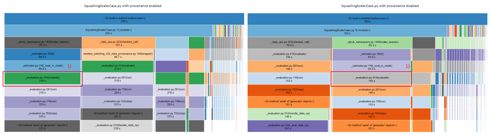
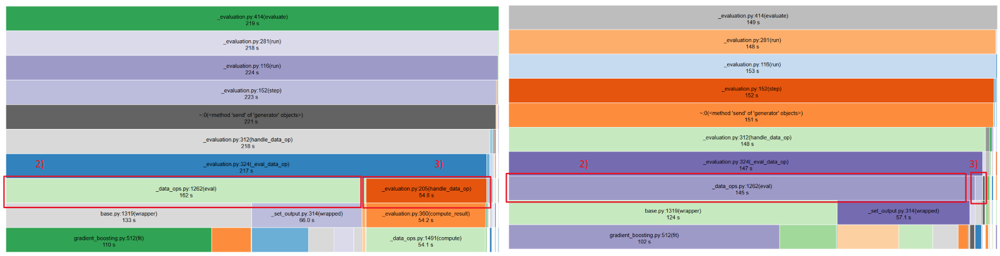
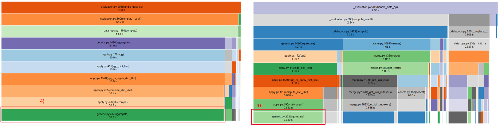
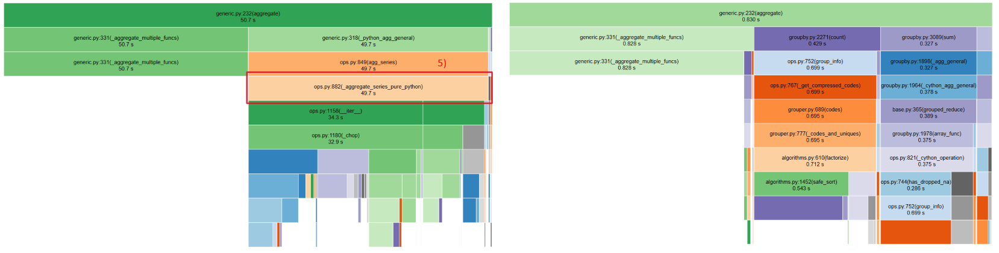

# Experiments

Below are instructions for running the pipelines, conducting the experiments, and the corresponding analysis.

Run all pipelines:
Linux/MacOS:
```
./run_all_pipelines.sh
```


Windows:
```
powershell -ExecutionPolicy Bypass -File run_all_pipelines.ps1
```


Aggregated Payments:
```
python -m pipelines.AggregatedPaymentsJoinCase
```

```
python -m pipelines.AggregatedPaymentsJoinCase --track-provenance
```


Basic data analysis
```
python -m pipelines.BasicDataAnalysis
```

```
python -m pipelines.BasicDataAnalysisCase --track-provenance
```


Fuzzy Joiner
```
python -m pipelines.FuzzyJoinerCase
```

```
python -m pipelines.FuzzyJoinerCase --track-provenance
```


Hands-on Column Selection Transformers
```
python -m pipelines.HandsOnColumnSelectionTransformersCase
```

```
python -m pipelines.HandsOnColumnSelectionTransformersCase --track-provenance
```


Customer Churn
```
python -m pipelines.CustomerChurnCase
```

```
python -m pipelines.CustomerChurnCase --track-provenance
```


Joiner
```
python -m pipelines.JoinerUseCase
```

```
python -m pipelines.JoinerUseCase --track-provenance
```


Leakage-safe Target Encoding
```
python -m pipelines.LeakageSafeTargetEncodingCase
```

```
python -m pipelines.LeakageSafeTargetEncodingCase --track-provenance
```


Spatial Join 
```
python -m pipelines.SpatialJoinCase
```

```
python -m pipelines.SpatialJoinCase --track-provenance
```


Squashing Scaler
```
python -m pipelines.SquashingScalerCase
```

```
python -m pipelines.SquashingScalerCase --track-provenance
```


Various String Encoders
```
python -m pipelines.VariousStringEncodersCase
```
```
python -m pipelines.VariousStringEncodersCase --track-provenance
```
---

## Results and Discussion
(Summarize key findings, performance results, and lessons learned.)


---


## Benchmarks

To execute all benchmarks for scaling:

```
python -m benchmarks.benchmark_run_all
```


You can also run specific benchmarks individually:

Runtime as a function of number of rows:

```
python -m benchmarks.benchmark_runtime_n_rows
```

Runtime as a function of number of operators:

```
python -m benchmarks.benchmark_runtime_n_operators
```

Memory overhead:

```
python -m benchmarks.benchmark_memory
```

---

## Current Limitations

We profiled the execution of a complex pipeline using `cProfile` and
visualized the results with `snakeviz`. The analysis revealed two
primary sources of overhead when provenance tracking is enabled:

-   `_data_ops.py (eval)` → \~17 seconds  (difference between operations marked with a 2)
-   `_evaluation.py (handle_data_op)` → \~52 seconds (difference between operations marked with a 3)

For comparison, when provenance tracking is disabled, `handle_data_op`
executes in **less than 3 second** for the same pipeline. This indicates
that provenance tracking is responsible for the majority of the runtime
overhead.

Overall, in a full pipeline execution time of approximately 163 seconds,
about 17 seconds (\~10%) can be attributed to additional
provenance-related logic outside aggregation, while aggregation itself
contributes the dominant overhead.

### Root Cause: Aggregation with Provenance Lists

A deeper inspection of the aggregation logic identified
`_aggregate_series_pure_python` as the primary bottleneck.

<p align="center">
  
</p>

<p align="center">
  
</p>

<p align="center">
  
</p>

<p align="center">
  
</p>

To reproduce these results, the following lines should be executed:

Run the following commands to profile the scripts:

```
python -m cProfile -o SquashingScalerCase_without_provenance.out .\pipelines\SquashingScalerCase.py
python -m cProfile -o SquashingScalerCase_with_provenance.out .\pipelines\SquashingScalerCase.py --track-provenance
```

To open the generated profiling files in SnakeViz:

```
snakeviz SquashingScalerCase_without_provenance.out
snakeviz SquashingScalerCase_with_provenance.out
```

The files used for this visualization can also be inspected via:

```
snakeviz "benchmark_logs/SquashingScalerCase_without_provenance.out"
snakeviz "benchmark_logs/SquashingScalerCase_with_provenance.out"
```

The main issue arises from injecting provenance information in the form
of: `_prov: list`

During aggregation (e.g., `agg(prov_col=list)`), provenance IDs are
collected into Python lists. This has an important consequence:

-   The provenance column changes its dtype from `int64` to `object`.
-   Once stored as Python objects, operations can no longer benefit from
    NumPy's vectorized execution.
-   Pandas falls back to pure Python handling for nested list
    aggregation.

Initially, we assumed that using optimized pandas aggregation functions
would retain high performance due to NumPy-backed execution. However,
this assumption does **not** hold for nested list aggregations. As soon
as lists are involved, pandas cannot leverage its optimized C/NumPy
routines, leading to significant slowdown.


In short:

> Aggregating provenance IDs into Python lists forces object dtype and
> results in pure Python execution, which becomes the dominant
> performance bottleneck.


### Summary of the Main Limitation

The central performance limitation of the current approach is:

> Using `agg(prov_col=list)` converts provenance columns from `int64` to
> `object`, forcing pure Python execution and making aggregation
> significantly slower.

A more scalable solution would avoid list-based aggregation entirely and
instead maintain provenance IDs in a flat, non-object
representation---even if that requires additional rows or a detached
provenance structure.

