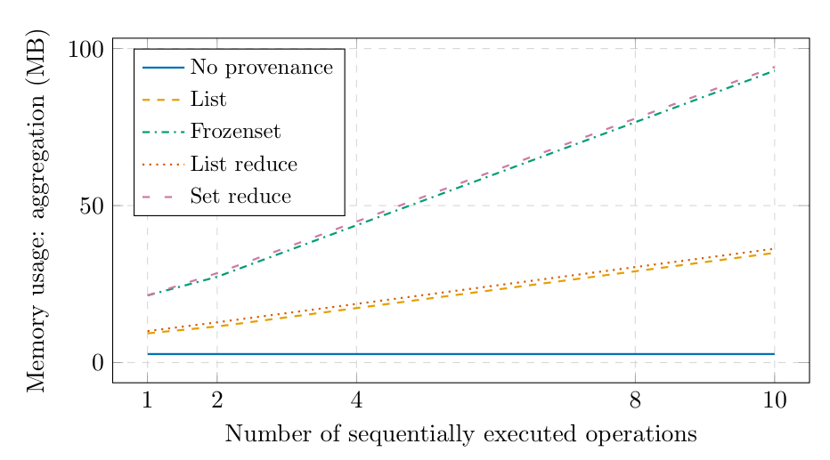
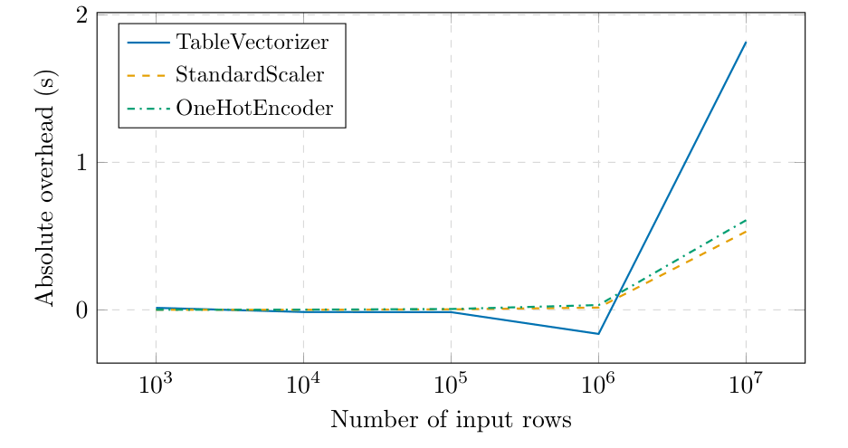
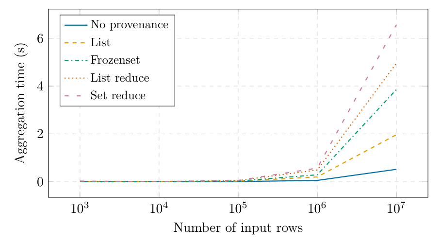

# Provenance Tracking for Skrub Data Ops Pipelines

## Table of Contents

- [Overview](#overview)
- [Motivation](#motivation)
- [Provenance Tracking in skrub](#provenance-tracking-in-skrub)
  - [Design Goals](#design-goals)
  - [Implementation Details](#implementation-details)
    - [Code Location](#code-location)
    - [Main Components](#main-components)
- [Supported Operations](#supported-operations)
  - [ASPJ Pandas Operations](#aspj-pandas-operations)
  - [scikit-learn Estimators](#scikit-learn-estimators)
  - [Train/Test Split](#traintest-split)
- [Inspecting Provenance](#inspecting-provenance)
- [Pipeline Use Cases](#pipeline-use-cases)
- [Testing](#testing)
- [Benchmarks](#benchmarks)
- [Experiments](#experiments)
- [Project Structure](#project-structure)
- [How to Run](#how-to-run)
- [Results and Discussion](#results-and-discussion)
- [Current Limitations](#current-limitations)
- [Authors](#authors)


## Overview
This project was developed as part of the Responsible Data Engineering Project at the DEEM Lab, TU Berlin.

The main goal is to introduce **provenance tracking** into **skrub DataOps pipelines**, enabling better transparency, debugging, and analysis of data transformations and machine learning workflows.

The project extends existing skrub functionality by tracking how data flows through complex pipelines built on top of pandas and scikit-learn.

---

## Motivation
Data provenance is essential for:
- Understanding how results are produced
- Debugging complex data pipelines
- Auditing and reproducibility
- Performance and optimization analysis

This project explores how provenance tracking can be integrated with minimal overhead into real-world data processing pipelines.

---

## Provenance Tracking in skrub
Provenance is introduced at the **DataOp level** in skrub.  
Each DataOp propagates **row-level provenance identifiers**, capturing how output rows depend on input rows across transformations.

### Design Goals
- Minimal runtime and memory overhead
- Compatibility with existing skrub pipelines
- Support for complex pandas and scikit-learn operations
- Clear, inspectable provenance metadata
- Extensibility to other pandas- and sklearn-compatible libraries

---

## Implementation Details

### Code Location
The main logic is implemented in:

- **.src/rdepro_skrub/monkey_patching_v02.py**  
  Core provenance propagation logic and DataOp wrappers.

- **.src/rdepro_skrub/utils.py**  
  Utilities for table ID definition and provenance evaluation.

---

### Main Components

#### Monkey Patching Strategy
Provenance is introduced by **wrapping two key execution points** in skrub:

1. **Wrapper around `skrub._data_ops._data_ops.Var.compute`**  
   Adds provenance ID columns at data ingestion time.

2. **Wrapper around `skrub._data_ops._evaluation.evaluate`**  
   This function is called during DataOp validation *before execution*.  
   The wrapper inspects:
   - The type of the DataOp subclass
   - Its arguments
   - The operation semantics  

   Arguments are then adjusted to ensure correct provenance propagation.

---

### Provenance ID Encoding
To minimize memory overhead and benefit from optimized numeric operations:

- Provenance columns are stored as **numpy.int64**
- Each provenance ID encodes:
  - **Table ID** (upper 16 bits)
  - **Row ID** (lower 48 bits)

The table ID is bit-shifted 48 bits to the left: ```(table_id << 48) | row_id```

This encoding supports:
- ~65,000 tables (2¹⁶)
- ~281 trillion rows per table (2⁴⁸)

This ensures globally unique provenance identifiers across pipelines.

---

## Supported Operations

### ASPJ Pandas Operations
Provenance is supported for **ASPJ-style pandas operations**, including:
- Aggregation
- Selection
- Projection
- Join

These operations form the relational backbone of data preparation pipelines.

#### Aggregation Handling
Aggregation is handled through the `CallDataOp` subclass.

If the DataOp corresponds to a pandas `.agg` call:
- The method name is inspected
- Additional aggregation arguments are injected
- Provenance columns are aggregated using the `list` function

This logic is implemented in provenance_agg(dataop)

Internally, the DataOp is inspected via: ```dataop._skrub_impl.__dict__```

#### Selection Handling 
Selection is handled automatically by pandas once provenance ID columns have been introduced into the table.

#### Projection Handling
Projection is supported through the use of the skrub `SelectCols` estimator.

If pandas-style column selection is used directly: ```df[[col_name1, col_name2]]```

the provenance columns are **not propagated**, as they are not included in the selected columns.

To ensure correct provenance propagation, projection must be performed using:```df.skb.select([col_name1, col_name2])```

Internally, `.skb.select()` creates a `SelectCols` DataOp that is applied via `.skb.apply(SelectCols)`. During the DataOp evaluation, provenance columns are injected into the arguments of `SelectCols`, ensuring that projection preserves the associated provenance information. Further details are provided in the section describing the handling of `ApplyDataOp` execution.


#### Join Handling
Propagation of provenance IDs for join operations is handled entirely by pandas once provenance columns are present in the input DataFrames.

---

### scikit-learn Estimators
Provenance is supported for scikit-learn estimators via `ApplyDataOp`.

Three cases are handled:

1. **Final estimators** (classifiers, regressors, outlier detectors)  
   Provenance columns are dropped before execution.  
   Provenance should be inspected before prediction using `evaluate_provenance`.

2. **SelectCols estimator (projection)**  
   Provenance columns are added to the selected columns list.

3. **Other transformers**  
   Provenance columns are dropped before execution and reattached afterward.

---

### Extensibility to Other Libraries
Provenance support can be extended to other pandas-compatible libraries by defining a function named: ```provenance_<function_name>```

Example: ```provenance_sem_map```

Such functions should be implemented as methods of the `ProvenanceModule` class. During execution, the appropriate provenance handler is discovered automatically using `getattr(ProvenanceModule, provenance_<function_name>)` and applied before the corresponding `DataOp` is evaluated. This follows a visitor-style pattern and allows new operations to be supported without modifying the core execution logic.

Provenance tracking can also be extended to other scikit-learn–compatible libraries. In the current implementation, this is achieved by adding a dedicated conditional branch for the specific estimator. If the number of such cases grows, the same visitor-style approach used for pandas operations can be adopted to avoid overly complex conditional logic.

An example is `RandomUnderSampler` from the scikit-learn–compatible imbalanced-learn library. Since this estimator changes the number of rows, provenance columns must not be dropped before execution. Instead, when rows are copied or removed, their corresponding provenance information should be propagated accordingly.


---

### Train/Test Split
For `train_test_split`, provenance can be inspected via:```split["train"]["_skrub_X"]```

---

## Inspecting Provenance
Provenance can be inspected using:

1. **show_provenance** – raw provenance columns  
2. **evaluate_provenance** – single cleaned provenance column  
3. **decode_provenance** – human-readable string format

---

## Pipeline use cases
To validate the robustness of our approach, we implemented **10 complex pipelines** that combine:
These pipelines were designed to reflect realistic data science workflows and stress-test the provenance tracking mechanism.

Each pipeline demonstrates:
- Correct provenance propagation
- Compatibility with existing skrub APIs
- Reasonable performance overhead

The calculations of running time are after deleting the pycache after every run so they can be as objective as possible. The runs
were done on:
- Processor	Intel(R) Core(TM) Ultra 7 155H (1.40 GHz)
- Installed RAM	32.0 GB (31.5 GB usable)
- System type	64-bit operating system, x64-based processor


**Basic Data Analaysis** - This pipeline performs an end-to-end data analysis, focusing on understanding delivery performance and customer satisfaction. It starts by loading multiple datasets—customers, orders, order items, payments, and reviews. The datasets are merged into a single df DataFrame, with date columns converted to datetime objects. The pipeline filters only delivered orders and computes new features, such as delivery_delay (difference between actual and estimated delivery dates), order_value (based on product price), and a binary is_delayed indicator. It cleans the data by removing NaNs and extreme outliers, then visualizes the data using skrub’s graphing tools. Finally, it prepares a subset of relevant features for predictive modeling, marking them appropriately as predictors (X) and target (y) for training a machine learning model, such as logistic regression, to predict whether an order will be delayed.
This combines data preprocessing, feature engineering, visualization, and machine learning preparation into a single reproducible pipeline.


Without provenance enabled: 4.86 seconds 
With provenance enabled: 5.01 seconds

**Fuzzy Joiner** - This pipeline is focused on exploring and joining transactional e-commerce data using skrub and a fuzzy matching approach. First, it loads multiple datasets—customers, orders, order items, payments, reviews, order payments, and geolocation Each dataset is wrapped with skrub.var() so that operations can track the origin of data. After confirming the loaded columns for order_items and payments, the pipeline performs a fuzzy join using fuzzy_join(). It attempts to join order_items and payments based on the columns product_id (from order items) and order_id (from payments), while also adding metadata about how the match was made (add_match_info=True). The resulting augmented_df contains combined information from both tables, allowing you to analyze relationships between products sold and payments received, including any fuzzy or approximate matches.

Without provenance enabled: 2.82 seconds
With provenance enabled: 2.91 seconds

**Joiners** - This pipeline performs a predictive modeling workflow to identify orders likely to receive bad reviews, using skrub. It begins by sampling all relevant datasets (customers, orders, order items, payments, reviews, order payments, geolocation, and products) and wrapping them with skrub.var() for tracking. Order-level aggregates are computed, including total items, total price, total freight, and total payments, which are merged into a master orders_full DataFrame. A binary target variable bad_review is created based on review scores (≤2). The pipeline further joins the first product per order with its category via skrub Joiner and merges geolocation features from the customer zip codes. Features are split into numeric and categorical types, with preprocessing applied via StandardScaler for numeric features and OneHotEncoder for categorical features. The preprocessed data is wrapped as X for modeling, while y represents the target. A HistGradientBoostingClassifier is then applied within the skrub framework. The pipeline uses skrub’s methods to apply the model, optionally split into training and test sets, fit a learner, evaluate performance, and generate prediction probabilities. Finally, the top predicted probabilities of bad reviews are extracted, enabling analysis of which orders are most at risk for poor customer satisfaction.

Without provenance enabled: 11.15 seconds 
With provenance enabled: 12.09 seconds

**Spatial Join** - This pipeline implements a predictive modeling workflow for identifying late deliveries orders. It starts by loading sampled datasets (customers, orders, order items, payments, reviews, geolocation, products) and wraps them in skrub.var().
Geolocation data is aggregated to compute centroids (mean latitude and longitude) for each zip code, city, and state combination. Two skrub.Joiner objects are created: one to join customer information to orders, and another to join geolocation centroids to customers, allowing enriched feature representation. The orders DataFrame is augmented with a binary target variable late, indicating whether the order was delivered after the estimated delivery date. The features (X) and target (y) are marked for skrub tracking. A TableVectorizer is applied to automatically encode categorical and numeric features in a machine-learning-ready format.Finally, a HistGradientBoostingClassifier is applied within the skrub pipeline, and 5-fold cross-validation is performed to evaluate predictive performance. The pipeline prints the transformed features, the cross-validation scores, and the mean accuracy.

Without provenance enabled: 21.88 seconds
With provenance enabled: 22.75 seconds

**Squashing Scaler** - This pipeline implements a customer-level revenue prediction workflow, with a key focus on handling outliers and extreme purchasing behavior using SquashingScaler from skrub. It starts by loading all relevant e-commerce datasets—customers, orders, order items, payments, reviews, order payments, and geolocation.The first step aggregates order-level data for each order (total_items, total_price, total_freight, total_payment) and merges it into a master orders_full DataFrame. NaN values in the aggregates are filled with zeros to handle missing payments or items. Then, customer-level features are computed by aggregating over all their orders, including metrics such as the number of orders, mean and sum of payments, mean items per order, mean order price, and mean freight. These features are enriched with geolocation information (latitude, longitude, city, and state) by merging with the customer and geolocation datasets.mThe pipeline splits features into numeric and categorical types. Numeric features are first “squashed” using SquashingScaler, which compresses extreme values to reduce the effect of outliers while preserving order, and then standardized using StandardScaler. Categorical features are one-hot encoded.
The target variable y is set as the total sum of payments per customer (sum_payment), representing future revenue potential. The preprocessed features (X) are wrapped in a skrub pipeline and passed to a HistGradientBoostingRegressor. The pipeline uses skrub’s make_learner and train_test_split to train the model, evaluate its performance, and generate predictions for each customer.

Without provenance enabled: 86.90 seconds 
With provenance enabled: 118.46 seconds

**Various String Encoders** - This pipeline addresses the problem of predicting order return risk (or delivery lateness) in e-commerce using multiple types of textual and categorical features and encoders, all wrapped in skrub. It starts by loading and sampling the main datasets—customers, orders, order items, payments, reviews, order payments, geolocation, and products—and wraps them as skrub.var() objects to track data lineage. The orders are augmented with a binary target variable is_late indicating whether delivery occurred after the estimated date. Order-level aggregates are created for items (total items, price, freight), payments (payment types, maximum installments, total value), and products (concatenated product categories, mean weight, maximum number of photos). Customer-level features (city and state) are also merged, producing a final df table with both numeric, categorical, and textual features.Three different encoding strategies are applied using skrub’s TableVectorizer:

    1. GapEncoder for high-cardinality categorical fields (vectorizerGap), capturing latent embeddings.

    2. MinHashEncoder for approximate similarity of sets (vectorizerHash).

    3. TextEncoder based on sentence-transformers for product and customer textual fields (vectorizerText).

Each encoded version of X is then used to train a HistGradientBoostingClassifier to predict is_late. The pipeline evaluates performance via cross-validation (cv=2) and stores results for each encoder type.

Without provenance enabled: 29.39 seconds 
With provenance enabled: 32.50 seconds

**Hands-On with Column Selection and Transformers**
This pipeline demonstrates how explicit column selection and heterogeneous feature transformations can be integrated into a skrub DataOps workflow while preserving provenance information. It focuses on a late-delivery prediction task in an e-commerce setting, using the Olist datasets.
The pipeline begins by loading and joining multiple raw tables, including orders, order items, payments, products, customers, and product category translations. These tables are merged at the order level to create a unified dataset containing transactional, product, payment, and customer-location information. Date columns are parsed into datetime objects, and a binary target variable is_late is created by comparing the actual delivery date to the estimated delivery date.
A key aspect of this pipeline is its hands-on approach to column selection and transformation. Instead of relying on automatic vectorization, features are explicitly grouped into datetime, numeric, and categorical subsets. Datetime features (such as the purchase timestamp) are encoded using a dedicated datetime transformer, numeric features are imputed and scaled, and categorical features are imputed and one-hot encoded. All projections are performed using df.skb.select(...) to ensure that provenance columns are correctly propagated when provenance tracking is enabled.
The transformed feature matrix is then passed to a HistGradientBoostingClassifier within the skrub framework. The pipeline uses skrub’s apply, mark_as_X, mark_as_y, and train_test_split mechanisms to build, train, and evaluate the model in a reproducible manner. This pipeline illustrates how fine-grained control over column selection and preprocessing can coexist with skrub’s DataOps abstraction, while remaining compatible with row-level provenance tracking.

Without provenance enabled: 150.83 seconds 
With provenance enabled: 166.86 seconds

**Aggregated Payments Join**
This pipeline focuses on aggregation followed by a join, a common pattern in data engineering workflows that is particularly sensitive to provenance tracking. It addresses the task of predicting whether an order will be delivered late by enriching the orders table with aggregated payment information.
The pipeline starts by loading the orders and payments datasets and wrapping them with skrub.var() to enable provenance tracking. Payment-level data is first aggregated at the order level using a group-by operation, computing features such as the total payment value, the number of payment records, the maximum number of installments, and the diversity of payment types. This aggregated table represents a many-to-one transformation, where each aggregated row depends on multiple original payment rows.
The aggregated payment features are then joined back to the orders table using a left join on order_id. Date columns are converted to datetime objects, and a binary target variable is_late is created by comparing the actual delivery date with the estimated delivery date. The resulting dataset combines original order information with derived payment-level features.
For modeling, numeric features are selected and scaled, while categorical features are encoded using simple encoders. A HistGradientBoostingClassifier is applied within the skrub framework, using skrub’s apply, mark_as_X, mark_as_y, and train_test_split utilities. This pipeline highlights how provenance information propagates through aggregation and join operations, while remaining compatible with standard machine learning workflows and maintaining reasonable performance overhead.

Without provenance enabled: 5.14 seconds 
With provenance enabled: 7.66 seconds

**Leakage-Safe Target Encoding (Train-Only Aggregation)**
This pipeline illustrates a common source of data leakage and demonstrates a safe way to build aggregated features in a skrub DataOps workflow. The task is to predict whether an order will be delivered late (is_late) using order-level and product-level information from the Olist datasets.
The pipeline loads and joins orders, order items, products, and product category translations to build an order-level table. A binary target variable is_late is created by comparing the delivered date to the estimated delivery date. The key idea is to build a “risk score” feature per product category, computed as the average late-delivery rate for that category.
To avoid leakage, this aggregation is computed only on the training split. The category-level late rate is derived from the training data and then joined back into both the train and test sets. Categories that appear only in the test set are handled by filling missing values with a default (e.g., the global late rate from train). The resulting dataset contains a leakage-safe aggregated feature that captures historical delay patterns without using information from the test labels.
For modeling, the pipeline combines the aggregated category risk score with simple numeric features (such as price and freight value) and uses a HistGradientBoostingClassifier within the skrub framework. It relies on skrub’s DataOps primitives (apply, mark_as_X, mark_as_y, train_test_split) and remains compatible with row-level provenance tracking. This pipeline is useful both as a realistic workflow and as a reference example for designing leakage-safe features in provenance-aware pipelines.

Without provenance enabled: 4.14 seconds 
With provenance enabled: 4.16 seconds

**Imbalanced Learning with RandomUnderSampler**
This pipeline demonstrates provenance tracking in the presence of row-sampling operations, which are particularly challenging because they change the number of rows and may duplicate or remove records. The task is a binary classification problem on the Olist datasets, where the goal is to predict whether an order will be delivered late (is_late), a label that is typically imbalanced.
The pipeline loads and joins the core Olist tables required to build an order-level dataset, including orders, order items, payments, and customer location information. Datetime columns are parsed and a binary target variable is_late is computed by comparing the delivered date with the estimated delivery date. A small set of numeric and categorical features is selected for modeling.
To address the class imbalance, the pipeline applies RandomUnderSampler from the imbalanced-learn library to downsample the majority class in the training set. Unlike standard scikit-learn transformers that preserve the number of rows, this operation changes the dataset cardinality and therefore requires careful provenance propagation. The pipeline then preprocesses numeric features with scaling and categorical features with one-hot encoding, and trains a HistGradientBoostingClassifier. Evaluation is performed on a held-out test set using skrub’s train/test utilities.
This pipeline is a useful stress test for provenance tracking because it highlights how provenance identifiers should behave when rows are removed or selected by a sampling strategy, while remaining compatible with a standard end-to-end machine learning workflow.

Without provenance enabled: 6.17 seconds 
With provenance enabled: 6.37 seconds

---

## Testing
We implemented a comprehensive test suite to ensure correctness and stability:
- Unit tests for individual provenance-enabled operations
- Integration tests for full pipelines
- Edge case testing for joins, aggregations, and transformations

**Unit Tests**

We implemented a focused unit-test suite to validate provenance propagation at the **DataOp boundary**, i.e. operation-by-operation, with small deterministic inputs.  
All tests are located in `tests/` and can be run with:
pytest -q

Below is an overview of the main tests and what they verify (one sentence each):
- test_provenance_activation.py
Checks that provenance tracking can be enabled/disabled cleanly and that provenance columns appear only when tracking is active.
- test_decode_prov_column.py
Validates that encoded provenance identifiers are correctly decoded into a stable, human-readable token format (e.g., table:row_id).
- test_groupby_agg_provenance.py
Ensures that groupby(...).agg(...) propagates provenance correctly for standard aggregations, including the union of contributing rows per group.
- test_groupby_named_agg_provenance.py
Checks provenance correctness for pandas “named aggregation” syntax and verifies that renaming outputs does not break provenance propagation.
- test_groupby_agg_list_provenance.py
Validates the special provenance aggregation strategy where provenance columns are aggregated via list and then normalized back to a single provenance representation.
- test_groupby_agg_string_provenance.py
Confirms robustness when aggregation specs are provided as strings (pandas-style), ensuring the correct provenance handler is triggered.
- test_merge_inner_provenance.py
Checks that inner joins keep only matching rows and that output provenance correctly combines contributing rows from both sides of the join.
- test_merge_left_provenance_nulls.py
Validates left joins with missing matches: unmatched rows must keep left-side provenance and handle right-side provenance as null/empty appropriately.
- test_merge_right_provenance_nulls.py
Same as above for right joins: unmatched rows must keep right-side provenance and handle left-side provenance as null/empty appropriately.
- test_merge_chain_provenance.py
Ensures provenance remains consistent across multiple consecutive joins, i.e., provenance composition is stable over a join chain.
- test_isin_filter_provenance.py
Checks selection/filter operations (e.g., isin) preserve provenance for retained rows and do not introduce spurious provenance.
- test_estimator_boundary_no_prov.py
Ensures that when provenance is disabled (or at estimator boundaries where provenance must be dropped), ML estimators receive clean inputs without provenance columns.
- test_predictor_boundary_no_prov.py
Validates the prediction boundary behavior: provenance should not leak into the predictor input, while provenance remains inspectable before/after the boundary as intended.
- test_DeterminismCheck.py
Runs an end-to-end pipeline twice and asserts identical outputs (after NaN normalization), detecting any non-determinism introduced by provenance handling or pipeline steps.


**test_DeterminismCheck** - This script is designed to check the determinism of a skrub-based pipeline by running it twice and comparing the outputs. Here's a breakdown of what it does:

Setup:
Adds the project’s parent directory to sys.path so modules can be imported reliably.
Parses a --track-provenance argument to optionally enable skrub provenance tracking.
Helper Function (replace_nan_with_minus_one):
Converts NaN values to -1 recursively in lists or arrays.This is important because NaN != NaN in pandas/numpy, which would make deterministic comparisons fail.
Script Execution (run_script):
Runs the target script (BasicDataAnalysisCase.py) using subprocess.
Expects the script to save its output (likely a skrub DataFrame or a wrapper) to a pickle file (output.pkl).
Loads the pickle for further inspection.

Determinism Check:
Runs the target script twice, capturing outputs out1 and out2.
Converts skrub outputs to pandas DataFrames with .skb.preview().
Normalizes NaN and provenance columns to -1 to ensure a fair comparison.
Compares the two DataFrames with .equals().

Result: -> Prints ✅ if the outputs are identical, ❌ if they differ.
This test might not be functional if the sampling is still turned on when reading from the file. When turned off, this test works


---

## Benchmarks
To evaluate performance, we designed benchmarks comparing:
- Pipelines with provenance tracking enabled
- Equivalent pipelines without provenance tracking

Metrics include:
- Execution time overhead
- Memory usage overhead

All benchmarks are executed on the following system:
- Processor	AMD Ryzen 7 4800H with Radeon Graphics (2.90 GHz)
- Installed RAM	16,0 GB (15,4 GB usable)
- System type	64-bit operating system, x64-based processor

### Benchmark: Memory Overhead - Single Aggregation

<p align="center">
  
</p>

**Goal**

Compare the memory footprint of different collection types when sequentially merging and aggregating DataFrames 10 times, focusing on the overhead introduced by collecting provenance ids in the collections.

**Setup**
- The same data, stored in different skrub variables (each with unique provenance IDs), is repeatedly merged into the final result, generating new provenance IDs at each step.
- The benchmark performs a max aggregation over identical non provenance values, so the memory used by the actual data does not increase.
- Memory growth comes solely from the lists of provenance IDs.
- Therefore, any observed memory overhead is entirely due to provenance tracking.

**Key Findings**
- Lists are more memory-efficient than sets.
- A flat list [1,2,3] (list_reduce) uses more memory than a nested structure (list) [[[1],2],3].
- The difference likely arises from implementation details: list_reduce generates empty lists [], while list may produce NaN values in this scenario.


### Benchmark: Runtime Overhead – Consecutive `merge + agg`

<p align="center">
  
</p>

**Goal**

Evaluate scalability and identify differences between provenance collection strategies.


**Setup**

Using the same setup as in the memory benchmark, this experiment measures 
runtime overhead when repeatedly executing `merge` + `agg` operations.  
Different strategies for collecting provenance IDs inside the aggregation 
function are compared.

**Key Findings**

- Runtime scales poorly with the number of consecutive operations.
- The growth appears close to quadratic.
- No significant performance differences are observed between the tested functions.
- Overhead is dominated by repeated provenance handling rather than the specific aggregation strategy.


### Benchmark: Runtime Overhead – Different Estimators

<p align="center">
  
</p>

**Goal**

This benchmark evaluates whether different estimators introduce varying 
absolute runtime overhead when provenance tracking is enabled.

**Setup**

The runtime is measured across three sklearn-based estimators while 
processing up to 10 million rows.

**Key Findings**

- Most sklearn estimators show similar absolute overhead.
- The measured overhead is approximately **0.5 seconds for 10 million rows**.
- The overhead primarily results from dropping and reattaching provenance columns.
- `TableVectorizer` shows higher variance.
  - This is likely due to its longer execution time.
  - Longer runtimes increase susceptibility to background system noise.

Overall, the estimator choice has minimal impact on provenance overhead.

## Benchmark: Runtime Overhead – Different Reduce Functions

<p align="center">
  
</p>


**Goal**

Compare runtime overhead introduced by different aggregation reduce functions.

**Setup**

- Aggregation pattern:
  `.agg({"text": count, "_prov0": agg_func, "_prov1": agg_func})`
- Runtime is averaged over **5 runs**
- Evaluated across increasing numbers of rows

**Key Findings**

- `list` is the fastest reduce function.
- Despite being the fastest option, it still introduces significant overhead.
- For 10 million rows:
  - Baseline runtime: ~0.5 seconds
  - With provenance: ~2 seconds
  - ≈ 3× runtime increase

The overhead grows with dataset size and remains substantial even for the most efficient reduce function.

---

## Experiments
We conducted experiments to analyze:
- Provenance graph size growth
- Impact of pipeline complexity on overhead
- Scalability with increasing data size

These experiments provide insight into how the system behaves under realistic workloads.

---

## Project Structure
```text
.
├── src/                # Source code
├── tests/              # Test suite
├── benchmarks/         # Benchmark scripts
├── experiments/        # Experimental analysis
├── pipelines/          # Complex pipeline implementations
└── README.md
```

---

## How to Run
Here are commands for each singiliuar pipeline and for all of them together. In general, all pipelines must be run using 
**python -m pipelines.** with the flag **--track-provenance** in the end to run them

If you only wish to use our provenance module and not the pipeline use cases, simply add this at the top of your code of your
pipeline:

```
import argparse
parser = argparse.ArgumentParser()
parser.add_argument(
    "--track-provenance",
    action="store_true",
    help="Enable provenance tracking"
)
args = parser.parse_args()
if args.track_provenance:
    print("Provenance is enabled")
    from src.rdepro_skrub_provenance.monkey_patching_v02_data_provenance import enable_why_data_provenance, evaluate_provenance
    enable_why_data_provenance()
else:
    print("Provenance is disabled")
print("Libraries imported")
```

For this to work, you need to jave src/rdepro_skrub_provenance in your folder


Run all pipelines:
Linux/MacOS:
```
./run_all_pipelines.sh
```


Windows:
```
powershell -ExecutionPolicy Bypass -File run_all_pipelines.ps1
```


Aggregated Payments:
```
python -m pipelines.AggregatedPaymentsJoinCase
```

```
python -m pipelines.AggregatedPaymentsJoinCase --track-provenance
```


Basic data analysis
```
python -m pipelines.BasicDataAnalysis
```

```
python -m pipelines.BasicDataAnalysisCase --track-provenance
```


Fuzzy Joiner
```
python -m pipelines.FuzzyJoinerCase
```

```
python -m pipelines.FuzzyJoinerCase --track-provenance
```


Hands-on Column Selection Transformers
```
python -m pipelines.HandsOnColumnSelectionTransformersCase
```

```
python -m pipelines.HandsOnColumnSelectionTransformersCase --track-provenance
```


Imbalanced Undersampling
```
python -m pipelines.ImbalancedUnderSamplingCase
```

```
python -m pipelines.ImbalancedUnderSamplingCase --track-provenance
```


Joiner
```
python -m pipelines.JoinerUseCase
```

```
python -m pipelines.JoinerUseCase --track-provenance
```


Leakage-safe Target Encoding
```
python -m pipelines.LeakageSafeTargetEncodingCase
```

```
python -m pipelines.LeakageSafeTargetEncodingCase --track-provenance
```


Spatial Join 
```
python -m pipelines.SpatialJoinCase
```

```
python -m pipelines.SpatialJoinCase --track-provenance
```


Squashing Scaler
```
python -m pipelines.SquashingScalerCase
```

```
python -m pipelines.SquashingScalerCase --track-provenance
```


Various String Encoders
```
python -m pipelines.VariousStringEncodersCase
```
```
python -m pipelines.VariousStringEncodersCase --track-provenance
```
---

## Results and Discussion
(Summarize key findings, performance results, and lessons learned.)

---

## Current Limitations

We profiled the execution of a complex pipeline using `cProfile` and
visualized the results with `snakeviz`. The analysis revealed two
primary sources of overhead when provenance tracking is enabled:

-   `dataop.py (eval)` → \~14 seconds\
-   `_evaluation.py (handle_data_op)` → \~44 seconds

For comparison, when provenance tracking is disabled, `handle_data_op`
executes in **less than 1 second** for the same pipeline. This indicates
that provenance tracking is responsible for the majority of the runtime
overhead.

Overall, in a full pipeline execution time of approximately 137 seconds,
about 14 seconds (\~10%) can be attributed to additional
provenance-related logic outside aggregation, while aggregation itself
contributes the dominant overhead.

### Root Cause: Aggregation with Provenance Lists

A deeper inspection of the aggregation logic identified
`_aggregate_series_pure_python` as the primary bottleneck.

The main issue arises from injecting provenance information in the form
of:

    _prov: list

During aggregation (e.g., `agg(prov_col=list)`), provenance IDs are
collected into Python lists. This has an important consequence:

-   The provenance column changes its dtype from `int64` to `object`.
-   Once stored as Python objects, operations can no longer benefit from
    NumPy's vectorized execution.
-   Pandas falls back to pure Python handling for nested list
    aggregation.

Initially, we assumed that using optimized pandas aggregation functions
would retain high performance due to NumPy-backed execution. However,
this assumption does **not** hold for nested list aggregations. As soon
as lists are involved, pandas cannot leverage its optimized C/NumPy
routines, leading to significant slowdown.

In short:

> Aggregating provenance IDs into Python lists forces object dtype and
> results in pure Python execution, which becomes the dominant
> performance bottleneck.

### Potential Future Improvement

To address this overhead, a different provenance representation could be
explored.

Instead of collecting provenance IDs into lists like:

    3 → [1, 2]

we could keep them separate:

    3 → 1  
    3 → 2

This approach would avoid converting the provenance column to `object`
dtype and would allow operations to remain in `int64`, preserving
NumPy-level vectorization.

#### Advantages

-   Retains `int64` dtype
-   Enables vectorized NumPy execution
-   Avoids pure Python aggregation bottleneck

#### Disadvantages

-   Significant row explosion
-   Increased memory usage
-   More complex bookkeeping
-   Requires explicit tracking of input → output ID mappings

To make this feasible, provenance data should likely be stored
**separately from the main dataset**, rather than attached as additional
columns. During pipeline execution, operations would need to be replayed
on the detached provenance structure. This requires maintaining
consistent mappings between input and output row IDs.

While this design introduces additional implementation complexity and
memory overhead, it may substantially improve runtime performance by
preserving vectorized execution.

### Summary of the Main Limitation

The central performance limitation of the current approach is:

> Using `agg(prov_col=list)` converts provenance columns from `int64` to
> `object`, forcing pure Python execution and making aggregation
> significantly slower.

A more scalable solution would avoid list-based aggregation entirely and
instead maintain provenance IDs in a flat, non-object
representation---even if that requires additional rows or a detached
provenance structure.


---

## Authors
- Teodor Aleksiev 0530377
- Jeanne
- Yigit Mesci 0505962
- Eduard Chalovski 0412770

---

